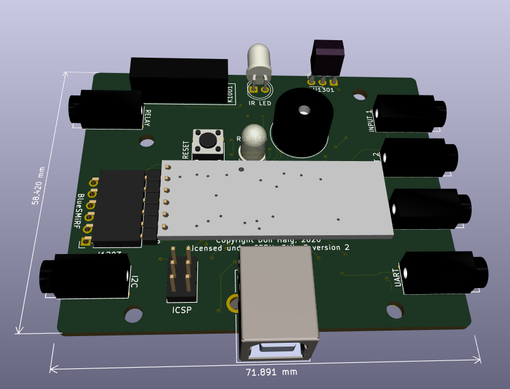

# ATmega32U4 AAC Controller

These directories contain design files for two versions of an AAC controller based on the Atmel ATmega32U4.
The designs are functionally identical but use microcrontrollers in different form factors. 
Version 1.2 is based on an ATmega32U4-AU (44-TQFP) while version 1.3 is based on an ATmega32U4-MU (44-VQFNA).

## Firmware

The most recent firmware for the controller can be found here: https://github.com/AbilitySpectrum/netCle/tree/master/Arduino/HubV2

## netClé

This controller design is used in netClé™, distributed by the Tetra Society of North America: https://tetrasociety.org/netcle/

### Configuration 

Once programmed, the controller can be configured using: https://ncconfig.github.io/public_html/index.html

 This documentation is licensed under a <a rel="license" href="http://creativecommons.org/licenses/by-sa/4.0/">Creative Commons Attribution-ShareAlike 4.0 International License</a>.

