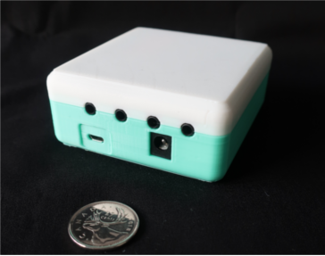
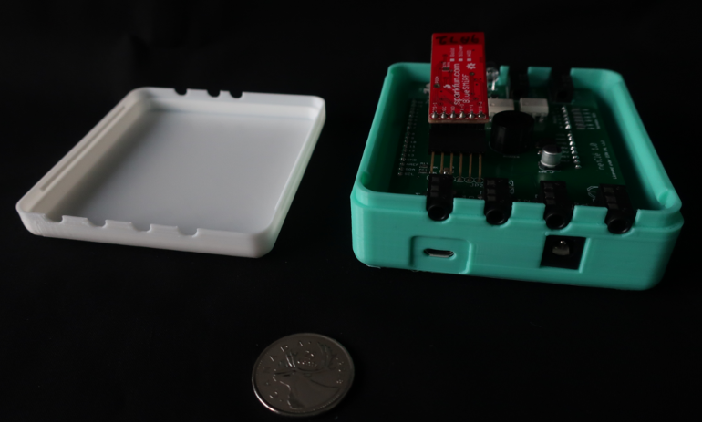

 

# Arduino Leonardo Controller

CAD files and firmware for a controller based on an Arduino leonardo board (https://store.arduino.cc/usa/leonardo) and a custom daughter board. 

## Leonardo Firmware

The most recent firmware for the controller can be found here: https://github.com/AbilitySpectrum/netCle/tree/master/Arduino/HubV1
(Please note that the firmware has been deprecated and is no longer actively supported.)

## Daughter Board Design Files

The design for the daughter board can be found here: https://github.com/AbilitySpectrum/Sensact/tree/master/Board/v4.2

 This work is licensed under a <a rel="license" href="http://creativecommons.org/licenses/by-sa/4.0/">Creative Commons Attribution-ShareAlike 4.0 International License</a>.
