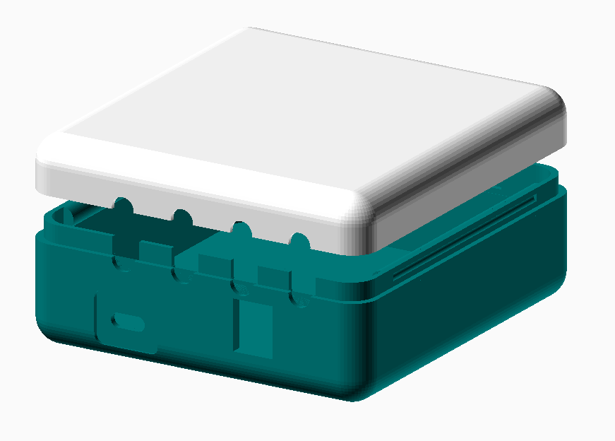

# Arduino Leonardo Controller Enclosure

Files were created using OpenSCAD version 2015.03-2 (https://www.openscad.org/).

The STL files for the enclosure can be found here:

   [STL file for enclosure top](stl_files/v2/enclosure_top_v2.stl)

   [STL file for enclosure bottom](stl_files/v2/enclosure_bottom_v2.stl)

G-Code files were created using Repetier-Host (https://www.repetier.com/) and optimized for a TEVO Michelangelo printer equipped with a 0.4mm nozzle.
They can be found here:

   [G-Code file for enclosure top](gcode_files/v2/enclosure_top_v2.gco)

   [G-Code file for enclosure bottom](gcode_files/v2/enclosure_bottom_v2.gco)

 This work is licensed under a <a rel="license" href="http://creativecommons.org/licenses/by-sa/4.0/">Creative Commons Attribution-ShareAlike 4.0 International License</a>.

