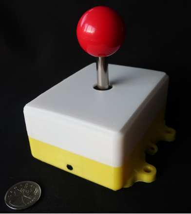
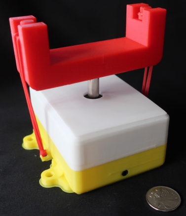
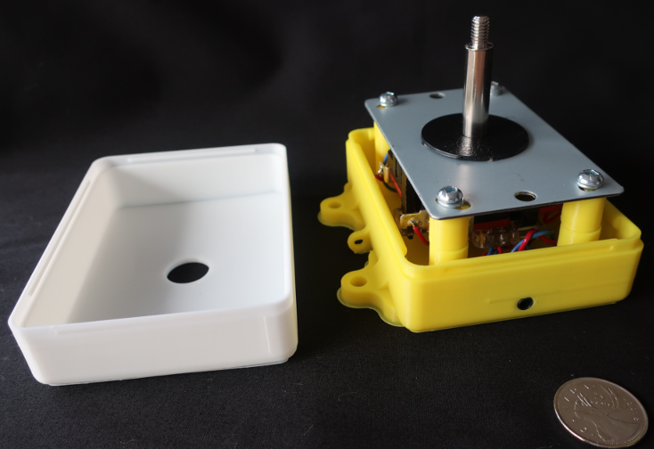

# Arcade Joystick

These directories contain design files for an arcade joystick peripheral.
 
This sensor can be plugged into an analog (yellow) controller input. It is activated by moving the handle.

## Hardware

Internal hardware is an arcade style 4/8 way joystick purchased from China.

 This work is licensed under a <a rel="license" href="http://creativecommons.org/licenses/by-sa/4.0/">
Creative Commons Attribution-ShareAlike 4.0 International License</a>.

