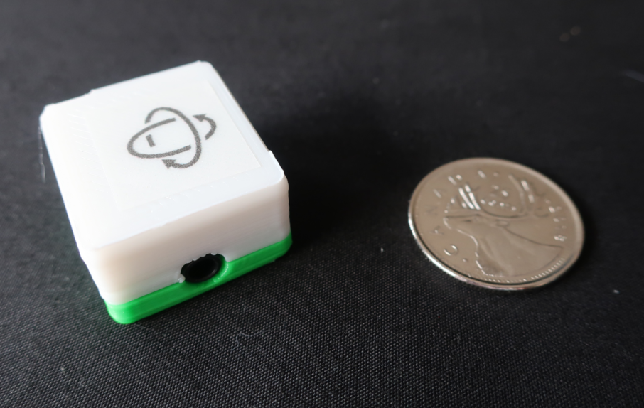
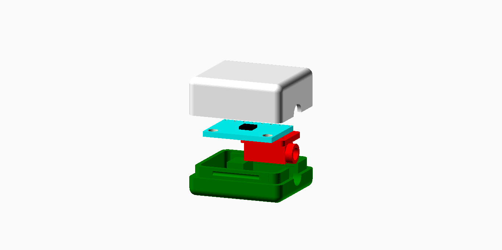

# MPU-6050 Gyroscope/Accelerometer

These directories contain design files for a gyroscope + accelerometer peripheral, for use with an
i2c (green) controller input.

## Hardware

The gyroscope/accelerometer peripheral is base on an MPU-6050 sensor:
<a rel="datasheet" href="https://www.invensense.com/wp-content/uploads/2015/02/MPU-6000-Datasheet1.pdf"> Datasheet</a>

I2C Address: 0x68

## Assembly

 This work is licensed under a <a rel="license" href="http://creativecommons.org/licenses/by-sa/4.0/">
Creative Commons Attribution-ShareAlike 4.0 International License</a>.
