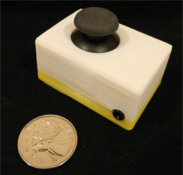
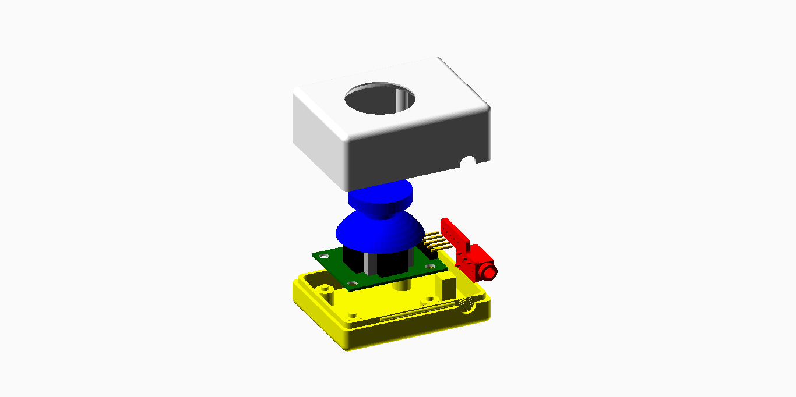

# HW-504 Joystick

These directories contain design files for an HW-504 joystick peripheral.

This sensor can be plugged into an analog (yellow) controller input. It is activated by moving the black knob.

## Assembly

 This work is licensed under a <a rel="license" href="http://creativecommons.org/licenses/by-sa/4.0/">
Creative Commons Attribution-ShareAlike 4.0 International License</a>.
