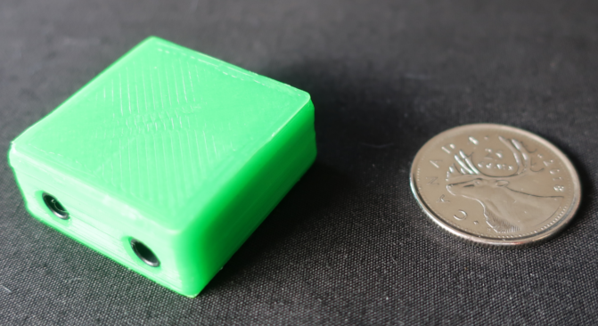
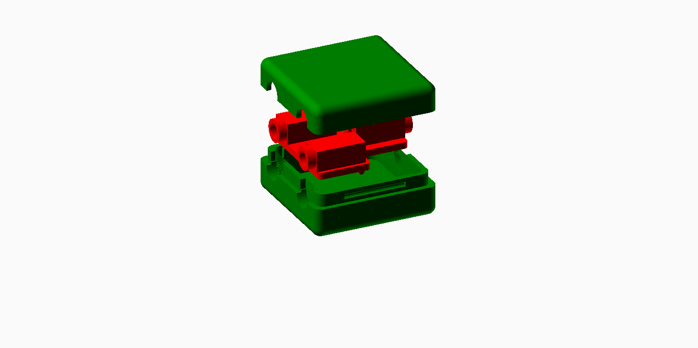

# I2C Splitter

These directories contain design files for an i2c bus splitter, for use with an i2c (green) controller input.

This splitter can be used to connect two i2c (green base) peripherals to the same i2c (green) input port.

(Multiple splitters can be daisy-chained together to accommodate more i2c peripherals, subject to i2c bus limitation
with respect to peripheral addressing.)

## Assembly                                                                                                                                       

  

 This work is licensed under a <a rel="license" href="http://creativecommons.org/licenses/by-sa/4.0/">
Creative Commons Attribution-ShareAlike 4.0 International License</a>.
