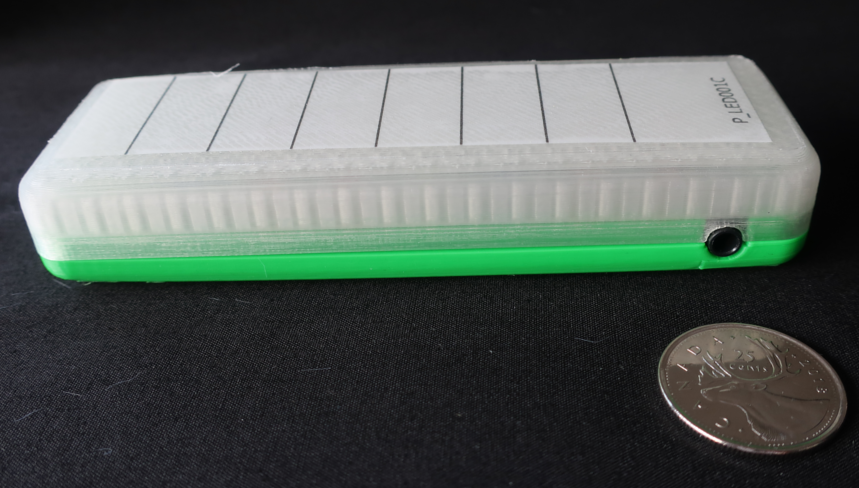
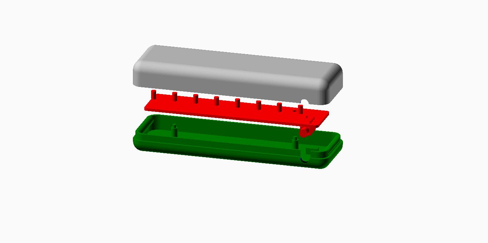

# Lightbox Display

These directories contain design files for a lightbox display peripheral, for use with an i2c (green) controller input.

## Hardware

The lightbox is based on a Microchip MCP23008 8-Bit I/O Expander: <a rel="datasheet" 
href="https://ww1.microchip.com/downloads/en/DeviceDoc/21919e.pdf">Datasheet</a>

I2C Address: 0x20

## Assembly

 This work is licensed under a <a rel="license" href="http://creativecommons.org/licenses/by-sa/4.0/">
Creative Commons Attribution-ShareAlike 4.0 International License</a>.

