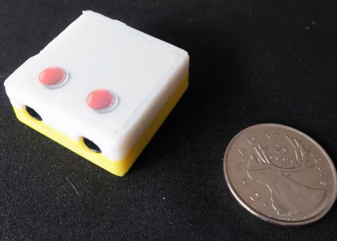

# Switch Adaptor

These directories contain design files for a switch adaptor.

The switch adaptor is __required to connect a commercial switch (or a tactile switch
with a black base)__ to an analog (yellow) controller input. 

Switches should be plugged into the switch adaptor inputs indicated with the "red button icons".
The output connector (no icon) should be connected an analog (yellow) controller input.

__Failure to use a switch adaptor with these types of switches will result in the power being shorted
to the ground when the switch is pressed, possibly damaging the controller unit.__

## Assembly

 
This work is licensed under a <a rel="license" href="http://creativecommons.org/licenses/by-sa/4.0/">
Creative Commons Attribution-ShareAlike 4.0 International License</a>.

