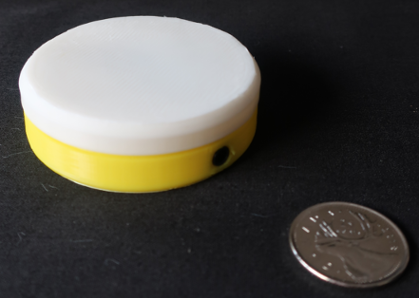
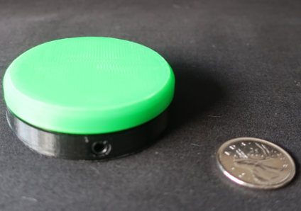
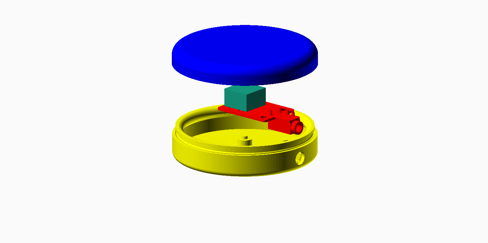

# Tactile Switch

These directories contain design files for a tactile switch peripheral.

## Tactile Switches with a Yellow Base

When pressed, tactile switches with a yellow base connect the "Tip" on the TRRS connector to "Ring 1" and
can be connected directly into an analog (yellow) controller input. 

## Tactile Switches with a Black Base

When pressed, tactile switches with a black base connects the "Tip" on the TRRS connector to "Sleeve", which
__will short power to ground if plugged directly into a controller__. A Switch Adaptor module should be used when
connecting a tactile switch, with a black base, to a controller analog (yellow) input.

## Assembly

## Parts

1 x 3.5mm Female Audio Connector 4 Pin DIP Stereo Headphone Jack PJ-320A

1 x 12mm x 12mm Tactile Switch

1 x tactile_switch_pcb_v2

1 x Round 59mm Button Enclosure

The PJ320A audio connector and the 12mm x 12mm tactile switch are available from various sources, including https://www.ebay.com/ and https://www.aliexpress.com/

 This work is licensed under a <a rel="license" href="http://creativecommons.org/licenses/by-sa/4.0/">
Creative Commons Attribution-ShareAlike 4.0 International License</a>.

